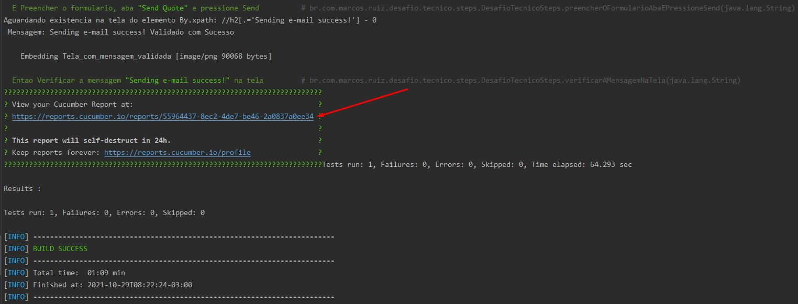
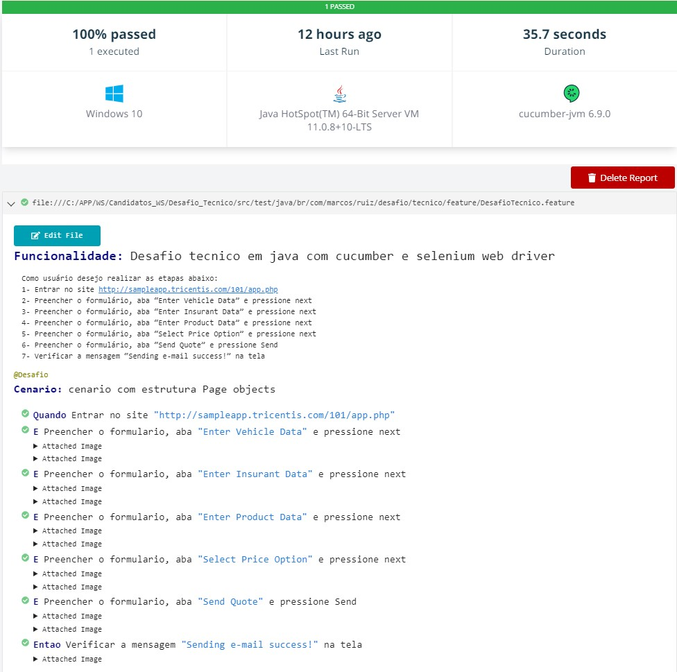

# Projeto java

## Descrição
Este projeto foi desenvolvido em ***Java***, ***Cucumber***, ***Selenium Webdriver***, ***JUnit*** e ***Maven***.

## Requisitos
Para executar o projeto é necessario ter o [Java](https://www.java.com/pt-BR/download/help/windows_manual_download.html) e [Mavem](https://maven.apache.org/install.html) instalado e configurado no seu equipamento. 

## Executar
O projeto também pode ser executado utilizando somente o terminal de comando.

* ### Build
Para realizar o build utiliza o seguinte comando no terminal  `mvn clean install` com este comando o test ira executar apos o build.

* ### Teste
Para realizar a execução do teste utiliza o seguinte comando no terminal `mvn test` .

## Report
Observe no terminal que ao final da execução é gerado o link do report.

***Segue abaixo um exemplo do report.***

